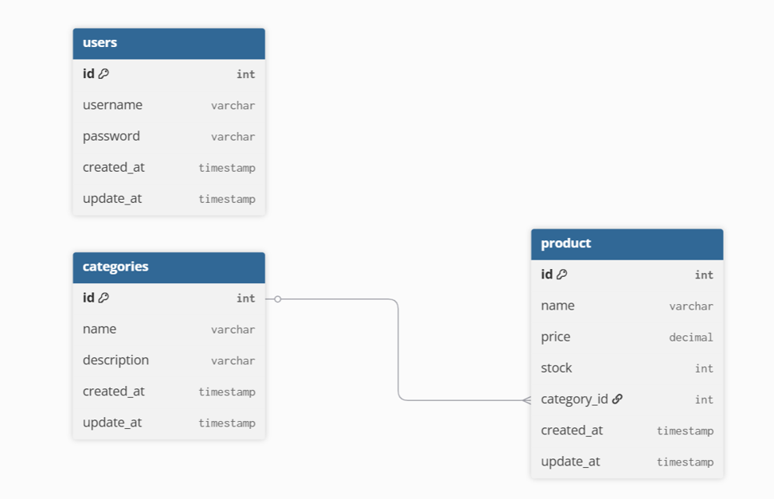
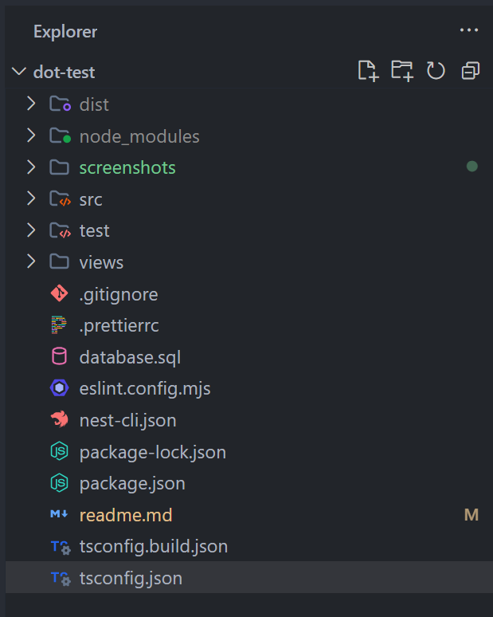
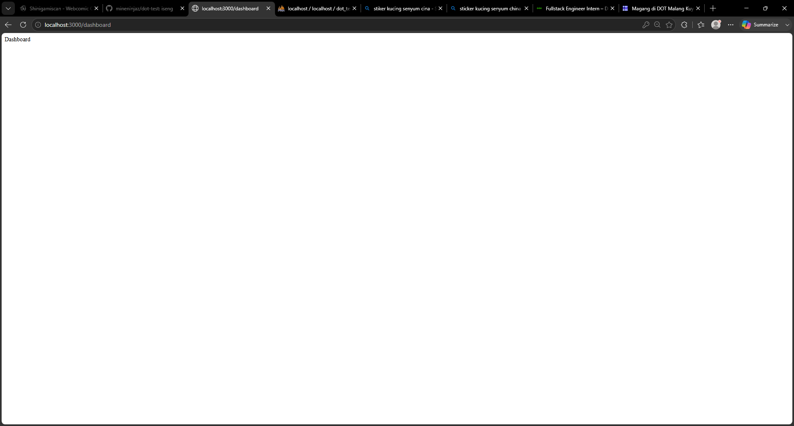
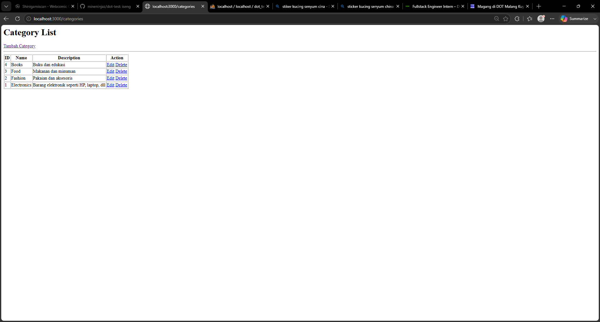
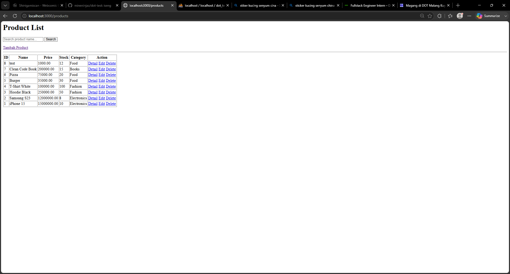

**Deksripsi Project**

#DOT Test - Admin Panel

Project admin panel sederhana menggunakan NestJS (MVC) dan MySQL

Fitur :

- Login
- Category CRUD
- Product CRUD
- Product Detail
- Product Search

Relasi database:
`**Category memiliki banyak product (One-to-Many)**

**Database Design
ERD :**




**Tech Stack**

- NestJS 11
- TypeScript
- MySQL
- mysql2
- EKS
- Express

**Structure Folder**




**Cara Install**

Clone Repository
`git clone https://github.com/mineninjaz/dot-test.git
`

Install depedency
`npm install
`

karena sudah ada  `package.json` & `package-lock.json`  jadi tinggal npm install aja

Run application
`npm run start:dev
`


**SET-UP  Database**

1. akses `localhost:/phpmyadmin`
2. Import file SQL
   Didalam folder `Dot-test` terdapat  file  `database.sql  ` tinggal import saja file ini
3. Ubah konfigurasi database
   `src/database/database.ts`

```
import mysql from 'mysql2/promise';

export const db = mysql.createPool({
    host: 'localhost',
    user: 'root',
    password: '',
    database: 'dot_test',  // Bagian Ini yang di ganti ya

});
```

**Login Credential**

Username:
admin

Password:
123456

**Screenshot Aplikasi**

Login


Dashboard



Categories



Products


